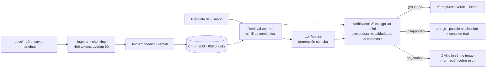

# 📚 DocuBot — RAG con grounding verificado

Chatbot RAG sobre artículos y ensayos de IA que **responde con citas de fuente**,
**detecta alucinaciones** (marca cuando la respuesta no está respaldada por el
corpus) y **dice «No lo sé»** cuando no hay contexto.

Proyecto de portafolio de AI Engineer: demuestra RAG más allá del tutorial
básico — grounding verificado, anti-alucinación y fallback.

---

## Arquitectura



## Comportamientos (demo)

| Estado | UI | Qué pasa |
|--------|----|----------|
| ✅ **grounded** | Verde | La respuesta está respaldada por fragmentos recuperados y se muestra con su `[Fuente: ...]` |
| ⚠️ **unsupported** | Rojo | El modelo respondió con conocimiento general que el corpus no respalda; se muestra el contexto real |
| 🤷 **no_context** | Gris | La pregunta es ajena al corpus → fallback "No lo sé" |

## Stack

- Python 3.11 + `venv`
- [LlamaIndex](https://www.llamaindex.ai/) 0.14 (indexación, retrieval, estructuras)
- OpenAI: `gpt-4o-mini` (generación + verificación) · `text-embedding-3-small` (embeddings)
- [ChromaDB](https://www.trychroma.com/) — base vectorial local persistente
- [Streamlit](https://streamlit.io/) — UI de chat

## Reproducir

```bash
python -m venv .venv
.venv\Scripts\activate          # Windows (Linux/macOS: source .venv/bin/activate)
pip install -r requirements.txt
copy .env.example .env          # pegar OPENAI_API_KEY real
python scripts/download_corpus.py   # (opcional) regenerar docs/
python -c "import ingest; ingest.configure(); ingest.ingest()"   # indexar corpus
streamlit run app.py            # UI
python 01_basic_rag.py "¿qué dice Sutton?"          # RAG mínimo + cita
python 02_verified_rag.py "¿pregunta?"              # RAG verificado
python 02_verified_rag.py --relaxed "¿pregunta?"    # modo demo (alucinación)
```

Costo aproximado de desarrollo: **US$1-3** (modelos baratos, pocos tokens).

## Progresión del código (por fases)

| Archivo | Fase | Qué demuestra |
|---------|------|---------------|
| `ingest.py` | 1-2 | Ingesta, chunking, embeddings, ChromaDB, retrieval reutilizable |
| `01_basic_rag.py` | 2-3 | RAG mínimo con citas `[Fuente: ...]` |
| `verified.py` | 4 | Núcleo de verificación: 2º call LLM → grounded/unsupported/no_context |
| `02_verified_rag.py` | 4 | CLI verificado: detector de alucinaciones + fallback + confianza |
| `app.py` | 5 | UI Streamlit: colores por estado, subida de docs extra, historial |
| `test_set.md` | 5 | 10 preguntas para evaluar los 3 comportamientos |
| `scripts/download_corpus.py` | 1 | Descarga y limpieza del corpus (reproducible) |

## Corpus (10 fuentes de libre acceso)

| # | Documento | Fuente |
|---|-----------|--------|
| 1 | The Bitter Lesson — R. Sutton | incompleteideas.net |
| 2 | A Few Useful Things to Know About ML — P. Domingos | homes.cs.washington.edu (preprint) |
| 3 | Computing Machinery and Intelligence — A. Turing (1950) | Dominio público |
| 4 | Attention Is All You Need — Vaswani et al. | arXiv 1706.03762 |
| 5 | The Unreasonable Effectiveness of RNNs — A. Karpathy | karpathy.github.io |
| 6 | Scaling Laws for Neural Language Models — Kaplan et al. | arXiv 2001.08361 |
| 7 | Survey of Hallucination in NLG — Ji et al. | arXiv 2311.05232 |
| 8 | Mechanistic Interpretability for AI Safety: A Review — Bereska & Gavves | arXiv 2404.14082 |
| 9 | Machine Learning for Compositional, and More, Intelligence — Bengio et al. | arXiv 2112.09332 |
| 10 | Retrieval-Augmented Generation (contexto) — Wikipedia | CC BY-SA 4.0 |

Cada documento lleva su procedencia (título, autor, URL, acceso) en el header.

## Limitaciones conocidas (diseño deliberado)

- **El verificador no es 100% fiable**: un segundo call al LLM puede errar en
  preguntas de matiz. Es una propiedad documentada de este enfoque; una
  alternativa sería groundedness con modelos especializados (p. ej. RAGAS,
  NLI) o verificación por fragmentos exactos (string matching).
- **Modo estricto vs demo**: con el prompt estricto el modelo casi nunca
  inventa (prefiere «No lo sé»); el estado ⚠️ se demuestra en modo `--relaxed`.
  Es un tradeoff intencional de prompt engineering.
- **Umbral de similitud**: la etiqueta "No lo sé" depende en parte de la
  decisión del verificador; no se usa un umbral duro de score (se muestra como
  métrica informativa).
- **Chunking fijo**: 400 tokens con overlap 50; documentos con estructura
  distinta (papers vs ensayos) podrían beneficiarse de chunking jerárquico.
- **Contenido**: solo fuentes de libre acceso; citadas en esta tabla y en cada
  archivo del corpus.

## Proyectos similares / siguientes pasos

- Evaluación cuantitativa con [RAGAS](https://docs.ragas.io/) (faithfulness, answer relevancy)
- Grounding por NLI (modelo de entailment) en lugar del 2º LLM
- Chunking jerárquico + reranker (p. ej. Cohere Rerank) para las preguntas de matiz